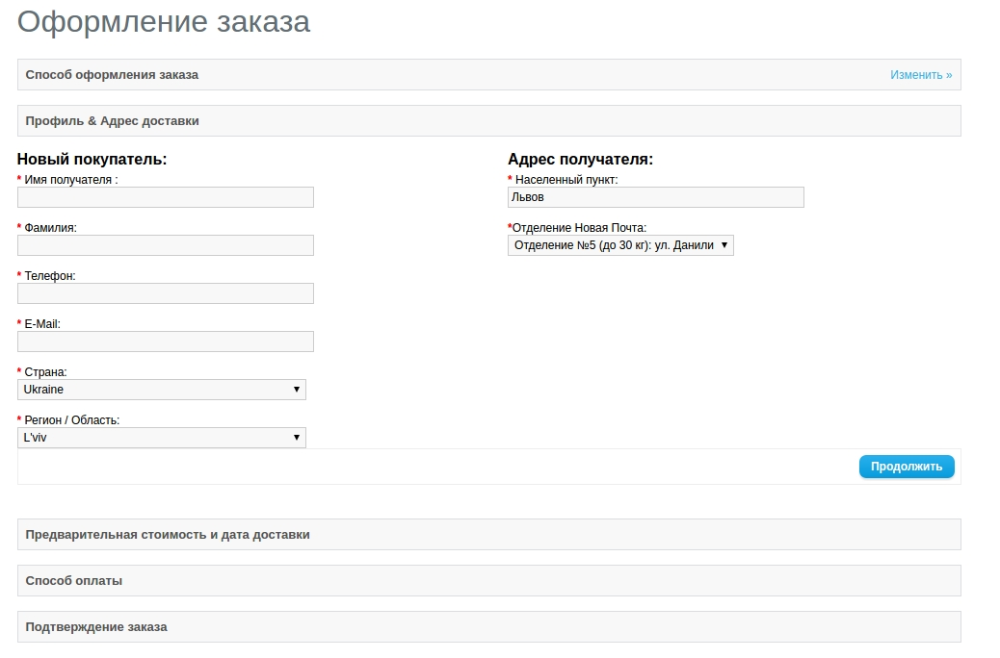
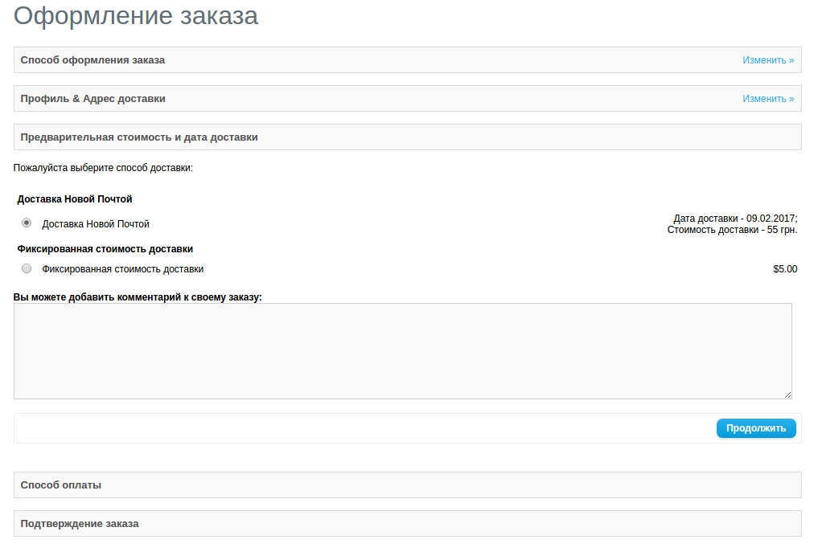
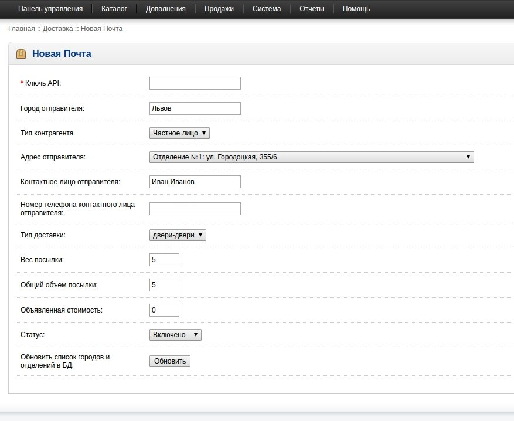
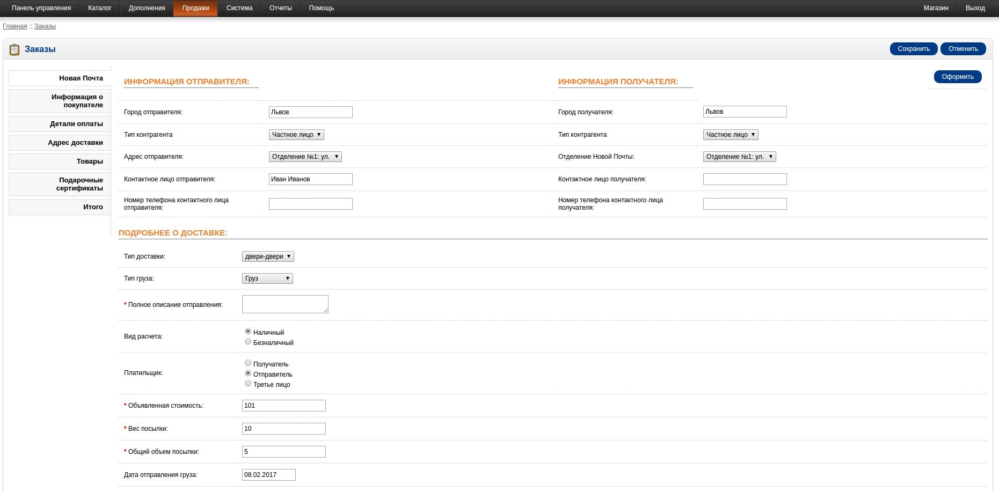

Модуль "Новая почта"
============================

Описание
---------------

При оформлении заказа нужно ввести название города и выбрать отделение:

Вычисление стоимости доставки:

Настройка
---------------

Модуль настраивается в админке по адресу: *Дополнения > Модули доставки > Новая почта*.

*API-ключ* — необходимо получить в [личном кабинете](https://my.novaposhta.ua/settings/index#apikeys) my.novaposhta.ua.

*Город отправителя* — город, с которого будут отправляться заказы.

*Адрес отправителя* — адрес, с которого будут отправляться заказы.

*Статус* — включения/выключения модуля.

*Обновить список городов и отделений в БД* — обновление списка городов и отделений, находящихся в **Адрес отправителя**.

Использование
-------------------
После оформления заказа в админ-панели появится информация о данном заказе, при редактировании которого в разделе **Новая почта** есть возможность указать отправителя и получателя. Чтобы попасть на страницу редактирования заказа нужно перейти в **Продажи** > **Заказы** и нажать **Изменить**.

После нажатия на клавишу **Оформить** на сайте Новой почты должна появиться накладная с информацией о данном заказе.